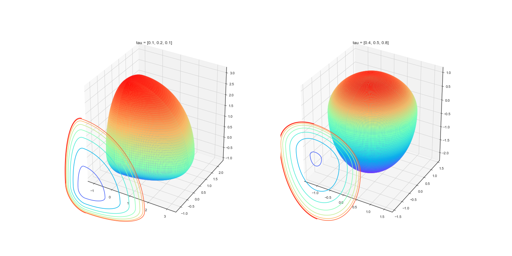
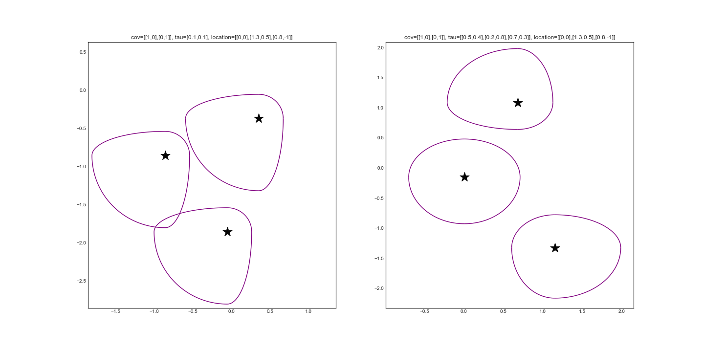
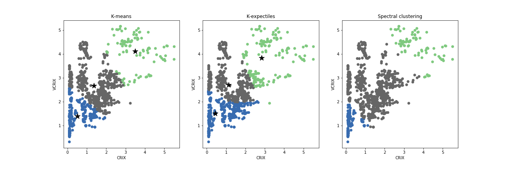
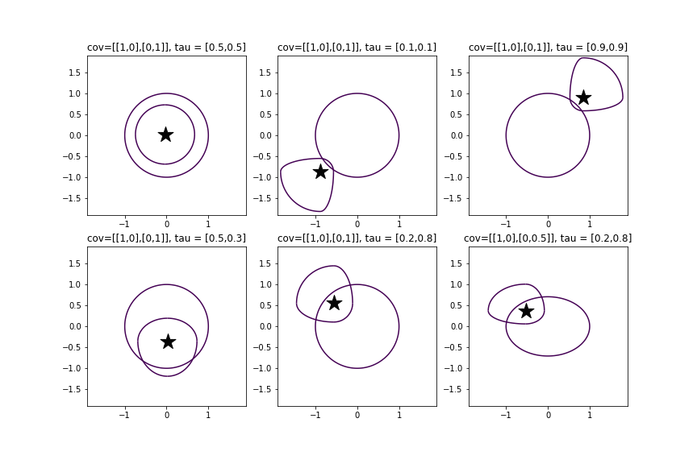

[](http://quantlet.de/)

## [](http://quantlet.de/) **KEC** [](http://quantlet.de/)

```yaml

Name of QuantLet : 'KEC'

Published in : 'JMVA'

Description : 'A novel clustering algorithm based on expectiles. The cluster centres are defined as multivariate expectiles and clusters are searched via greedy algorithm by minimising within cluster tau variance. Applications and simulations are provided.'

Keywords : 
- 'clustering'
- 'machine learning'
- 'partitioning clustering'
- 'parameter tuning'
- 'multivariate expectiles'
- 'greedy algorithm'
- 'K-means clustering'
- 'quantile based clustering'


Author : 'Bingling Wang'

Submitted : 'Wednesday, June 24 2020 by Bingling Wang'

Example : 'Cluster shapes of fixed and adaptive tau level, clusters on CRIX VCRIX data, image segmentation, clusters on nasdaq news'

```







